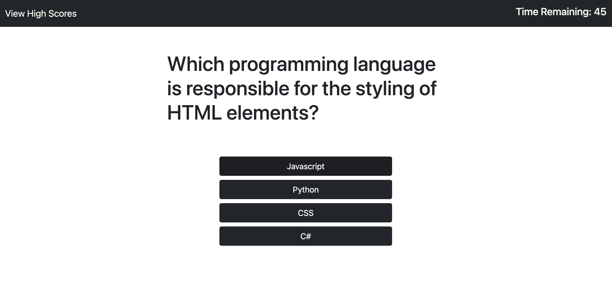

# code-quiz

## Description

This is my fourth homework assignment for the University of Denver Web Development Boot Camp! I'm fairly proud of this one - it's the first interactive program I have built fully from scratch using HTML, CSS, and JavaScript!
This project is a multiple choice quiz application for a user to play. The user's goal is to answer all questions correctly in as little time as possible. Their score is simply the time remaining when they complete the game (the higher the number, the better.) The game provides immediate user feedback when a question is selected (correct or incorrect) and also gives them the option to save their high score in local memory to compare against other users.
So go ahead and give it a shot! What's your high score? ;)

## Deployment

The code (and associated assets) are hosted right here in this GitHub repository, and it's all live on the web thanks to GitHub pages. If you would like to check it out, you can view the site at the link below:

<a href="https://lukeoxner.github.io/code-quiz" target="_blank"><b>code-quiz Live Website</b></a>
  

## Credits

This project was made using HTML, CSS, and Javascript - completely from scratch, by yours truly!  
